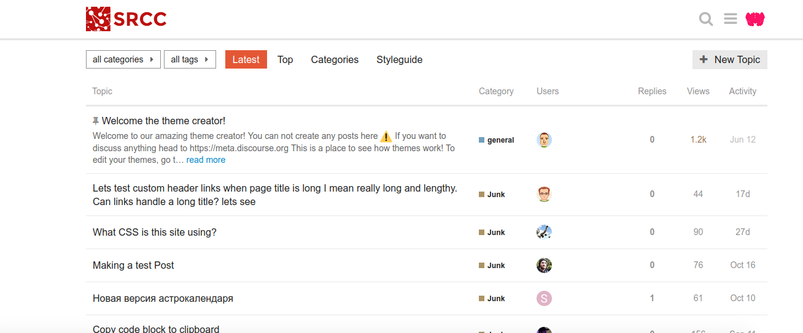

# Discourse Theme

This is a discourse theme developed at [https://meta.discourse.org/](https://meta.discourse.org)
Intended for testing on [AskCI](https://ask.cyberinfrastructure.org/). It looks like this:



While the theme editor appears to save the work, it's good practice to also have
the export under version control, since it's just associated with my account 
and the running instance.

Included here is a theme for a topic named "stanford" along with site branding.

# Deploy an Instance
Here is how to deploy an instance with docker compose.

```bash
$ curl -sSL https://raw.githubusercontent.com/bitnami/bitnami-docker-discourse/master/docker-compose.yml > docker-compose.yml
$ docker-compose up -d
```

The username is "user" and the password is "bitnami123." More information about
this can be found [here](https://github.com/bitnami/bitnami-docker-discourse#environment-variables).


# AskCI Topic

We are testing this theme in the Ask Cyberinfrastructure site, which needed the following
style to override the defaults there. The theme is also called `stanford-research-computing`:

## CSS (Cascading Style Sheets)

```css
.category-stanford-research-computing .d-header {
    color: black !important;
    background-color: white !important;
    background-image: none !important;
    background: white !important;
}


.category-stanford-research-computing #site-text-logo {
    content: url("https://ask.cyberinfrastructure.org/uploads/default/original/1X/70525e0736735302dec325d09b34a3a0b2933c24.jpeg") !important;
    background: url("https://ask.cyberinfrastructure.org/uploads/default/original/1X/70525e0736735302dec325d09b34a3a0b2933c24.jpeg") no-repeat !important;
    display: inline-block;
    width: 80px;
    font-size: 0;
    margin-top: 5px;
    margin-bottom: 0px;
} 
```

## JavaScript (JS)

This should be placed in a head section, to adjust the category link when it's active.
```js
<script>
$(document).ready(function() {
    $('.category-stanford-research-computing .title a').attr('href', '/c/stanford-research-computing')
})
</script>
```


## About
This is what I wrote in the about section.

The Stanford Research Computing Center (SRCC) supports Stanford University
and the Stanford School of Medicine to provide resources for computational 
research, including high performance computing (HPC) systems, data storage, 
and training. This is a public board intended to foster a community around 
answering questions from the community. You can learn more about the SRCC 
by visiting http://www.sherlock.stanford.edu. 
